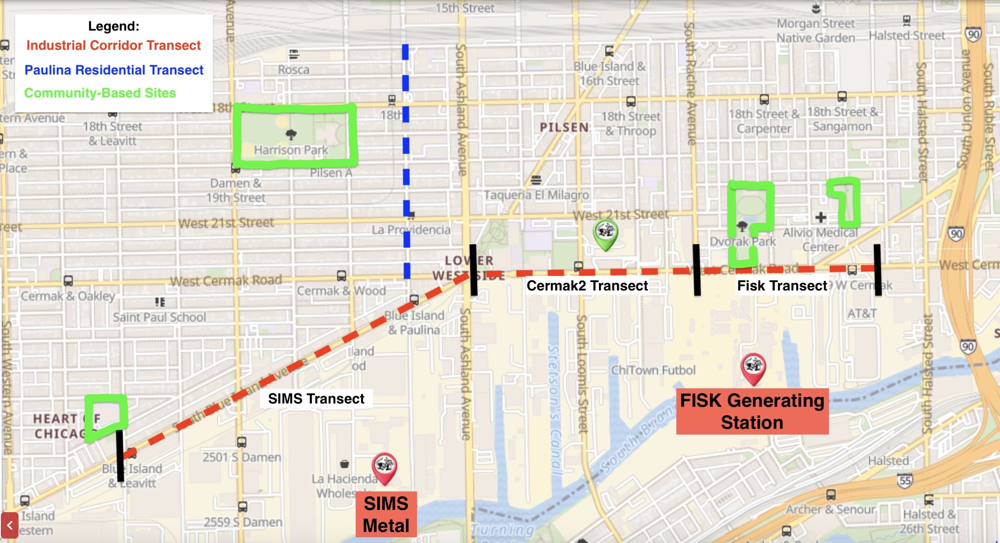

```{r load-packages, include = FALSE}
# Add any additional packages you need to this chunk
library(tidyverse)
library(tidymodels)
library(palmerpenguins)
library(knitr)
library(xaringanthemer)
```

```{r setup, include=FALSE}
# For better figure resolution
knitr::opts_chunk$set(fig.retina = 3, dpi = 300, fig.width = 6, fig.asp = 0.618, out.width = "80%")
```

```{r load-data, include=FALSE}
# Load your data here
Pb2 = read_csv("../data/survey_results.csv")
```

```{r echo = FALSE}
style_xaringan(
  title_slide_background_image = "img/light-brown-background-0nz9ynihuiauubfg.jpg"
)
```
---
class: center, middle

## How do surface soil lead levels vary across these different sample sites?

---

# Background

- Urban soils are often contaminated with lead from historical sources like leaded gasoline or leaded paint, as well as pollution from industrial sources

- Pilsen is known for its industrial corridor that has contaminated the air and the soil 

- Most facilities have been shut down, there are still two potential polluters that are still running: Fisk, a coal-run powerplant, and SIMS, a metal recycling facility.

---

class: inverse, middle, center

# Data Collection
```{r echo = FALSE, out.width = "80%", fig.align = "center", fig.cap = "Map of Screening Sites"}

```
---

# Methodology

- Explore relationship using boxplots and summary statistics 

- ANOVA 

- Linear regression Pb Concentration ~ Sample Site

- Linear regression Pb Concentration ~ Site Group


---

# Preliminary Data Exploration

```{r plot-iris, echo = FALSE}
# Code hidden with echo = FALSE
# Uses modified iris dataset from previous chunk
# Play around with height and width until you're happy with the look

ggplot(Pb2) +
  aes(x = PbMeasurement_ppm, y = SamplingSite) +
  geom_boxplot() +
    theme_classic(base_size = 15)+
    coord_cartesian(xlim = c(0, 900))+
   labs(
    x = "Sampling Site",
    y = "Pb Concentration (ppm)",
    title = "Pb Concentration across Sampling Sites")+
  theme_minimal()
```

---
# ANOVA

.pull-left[
- Null Hypothesis: All group means are equal
- Alternative Hypothesis: At least one group mean is different from the rest
- There is a significant difference in the mean values between each sampling site (p-value < 0.001)
- Reject the null hypothesis
]
.pull-right[
```{r}
site_aov <- aov(PbMeasurement_ppm ~ SamplingSite, data = Pb2%>%
            filter(PbMeasurement_ppm < 900)) #remove outliers
summary(site_aov)
```
]
---
# Linear Regression Pb Concentration ~ Sample Site

.pull-left[
- Sites were compared to the Cermak2 transect
- The 2 parks, elementary school, and garden are significantly lower than Cermak2 (p-value < 0.001)
- Fisk and SIMS are also significantly lower than Cermak2 (p < 0.05)
- Residential transect has no significant difference
- Sample sites explain about 18.61% of the variability within lead concentrations
]
.pull-right[
```{r}
site_lm <- lm(PbMeasurement_ppm ~ SamplingSite, data = Pb2%>%
            filter(PbMeasurement_ppm < 900))
summary(site_lm)
```

]

---

# Linear Regression Pb Concentration ~ Site Group

.pull-left[
- Compared each of the site categories to the garden category
- Industrial corridor category (p-value < 0.05) and residential transect (p-value < 0.001) are both significantly higher than the garden
- No significant difference between the garden, the park category, and the school
- Site groups explain about 19.57% of the variability within lead concentrations
]
.pull-right[
```{r}
#add new samplingsite categories
Pbdf <-Pb2 %>%
  mutate(SiteGroup = case_when(
    SamplingSite %in% c("SIMS", "Cermak2", "Fisk") ~ "IC",
    SamplingSite == "Paulina" ~ "Res",
    SamplingSite %in% c("Dvorak", "HarrisonPark") ~ "Park",
    SamplingSite == "IrmaRuizSchool" ~ "School",
    SamplingSite == "Paseo" ~ "Garden"
  )
         )
#Linear model Pb ~ GroupSite (industrial corridor vs residential vs community based sites)
Loc2 <- lm(PbMeasurement_ppm ~ SiteGroup, data = Pbdf)
summary(Loc2)
```

]

---

# Conclusion

- Site locations of parks, schools, and gardens have significantly lower lead concentrations than the industrial corridor and residential area
- The residential area is significantly higher than the industrial corridor and community-based locations
- The type of the site does appear to play a role in how surface soil lead concentrations vary across the Pilsen
- May be different factors driving its variability such as distance from potential polluters or historical lead contamination 


---

class: inverse, center, middle

# Thank you!
---